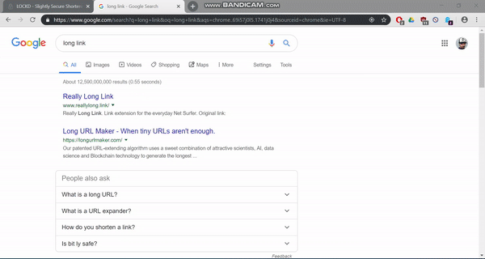

Lockd is a slightly secure url shortener which allows you to protect your url with a lock number, making them effectively private. 



# Dependencies

## Backend

* [Nodejs](https://nodejs.org/en/) - JavaScript runtime built on Chrome's V8 JavaScript engine.
* [Nginx](https://www.nginx.com/) - for url redirections and load balancing
* [Express](https://expressjs.com/) - Nodejs framework for building the RESTful API
* [Mongodb](https://www.mongodb.com/) - NoSQL database for rapid prototyping

## Frontend

* [ReactJS](https://www.mongodb.com/) - JavaScript library for building user interfaces.
* [Semantic-UI](https://react.semantic-ui.com/) - Responsive frontend framework for reactjs

# Using the project

1. Clone the project and install its dependencies:

```
$ git clone https://github.com/johncurcio/lockd.git
$ cd /client && npm install
$ cd /server && npm install
```

2. Install nginx and copy ``nginx.local.conf`` to conf folder.

3. Start the frontend and backend

```
$ cd /client && npm start
$ cd /server && npm start
```

# About me

Check out [curcio.dev](https://curcio.dev)